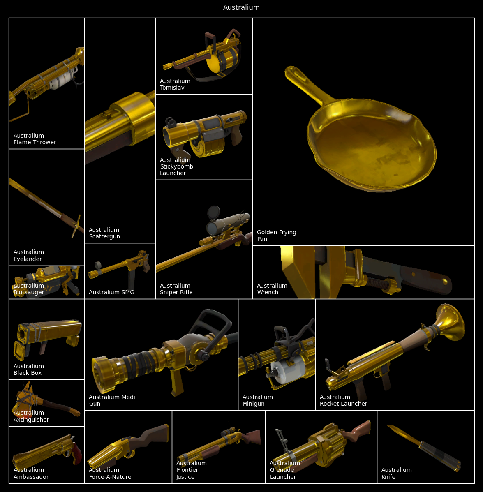

<!-- 
Copyright 2024 Kieran Harvie.
All rights reserved.
Use of this source code is governed by an Apache-style license that can be found in the LICENSE file.
-->

This repo is a quick treemap visualization of the expected value from a Mann vs. Machine tour completion in TF2.

It is basically a python script to transpose the data from in [this](https://www.youtube.com/redirect?event=video_description&redir_token=QUFFLUhqa3JhNkVYVGVaNW54c1ZDWW14SmdvUF9zREJpZ3xBQ3Jtc0ttWW0ySW5ETGJ4N3BOQm5SZ3VKclRxcUNucV9NNGNuTW5SU1RwcnVZZWZUMVk4WDJPX3R0Z1BWNnhIS0xjQTRnT0NvekpkeFV3QkJOMER4NmNBQXhZRHk0UklPUDl1dFAtOEVFR1Z3QnZ6cW1meHpqcw&q=https%3A%2F%2Fdocs.google.com%2Fspreadsheets%2Fd%2F1UvPC-FKVYYY8q8Zb18fjxb-AmZgZbQ471tu5TsjG3w0%2Fedit%3Fusp%3Dsharing&v=kPR0KjP4hC8) spreadsheet from this [this](https://www.youtube.com/watch?v=kPR0KjP4hC8) TheLetterZed video description into the [squarify](https://github.com/laserson/squarify/tree/master) module. 

Out of an abundance of caution I've decided not to redistribute Valve assets in a github I use as a portfolio.
So to use the australium and utility scripts you'll need to download and place png them in folders labeled 'australium' and 'misc_images'.
