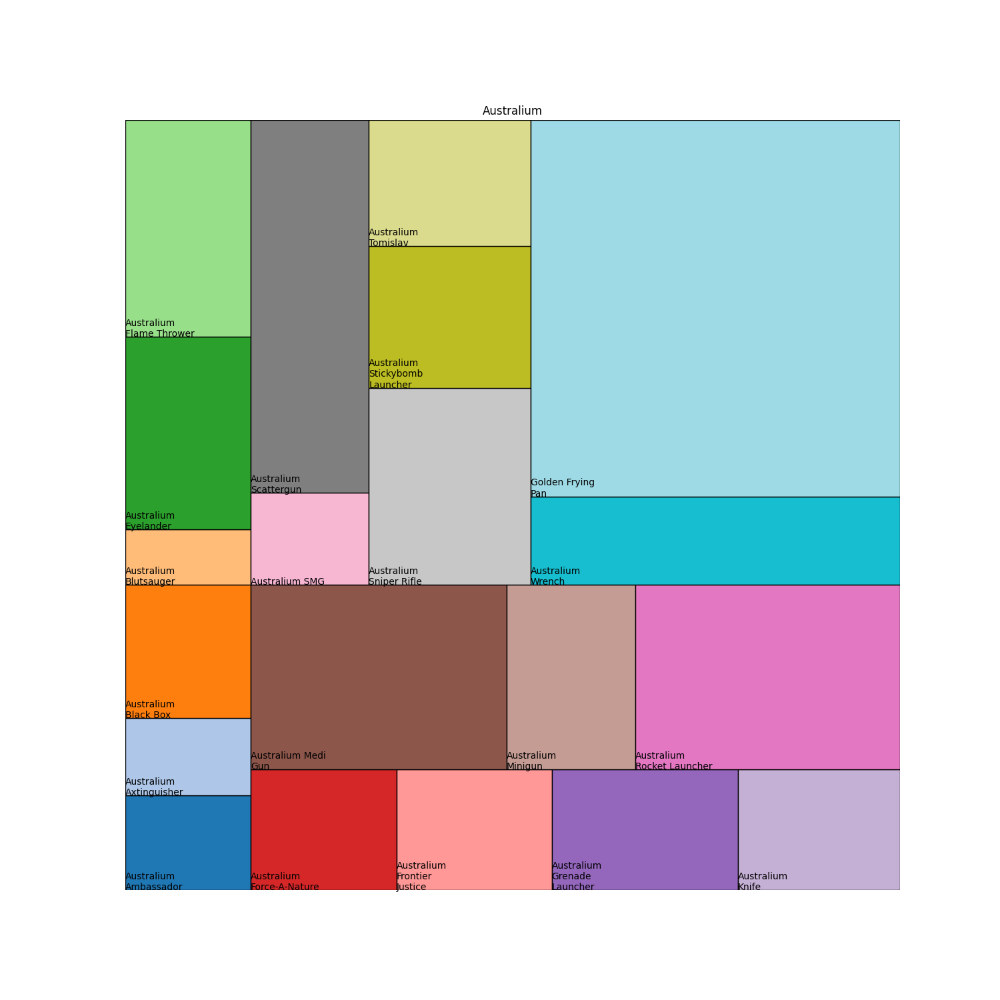
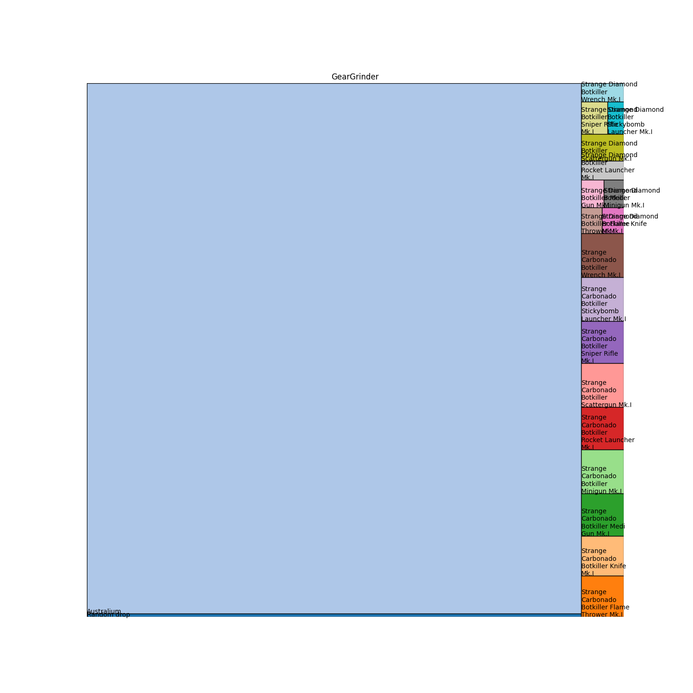
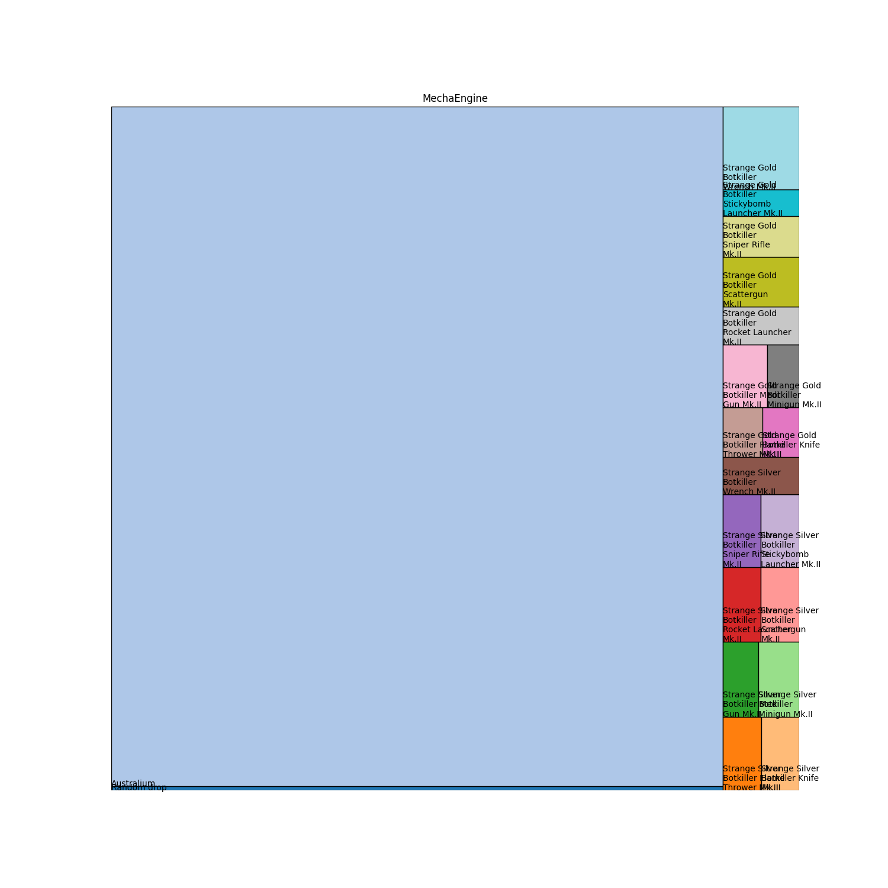
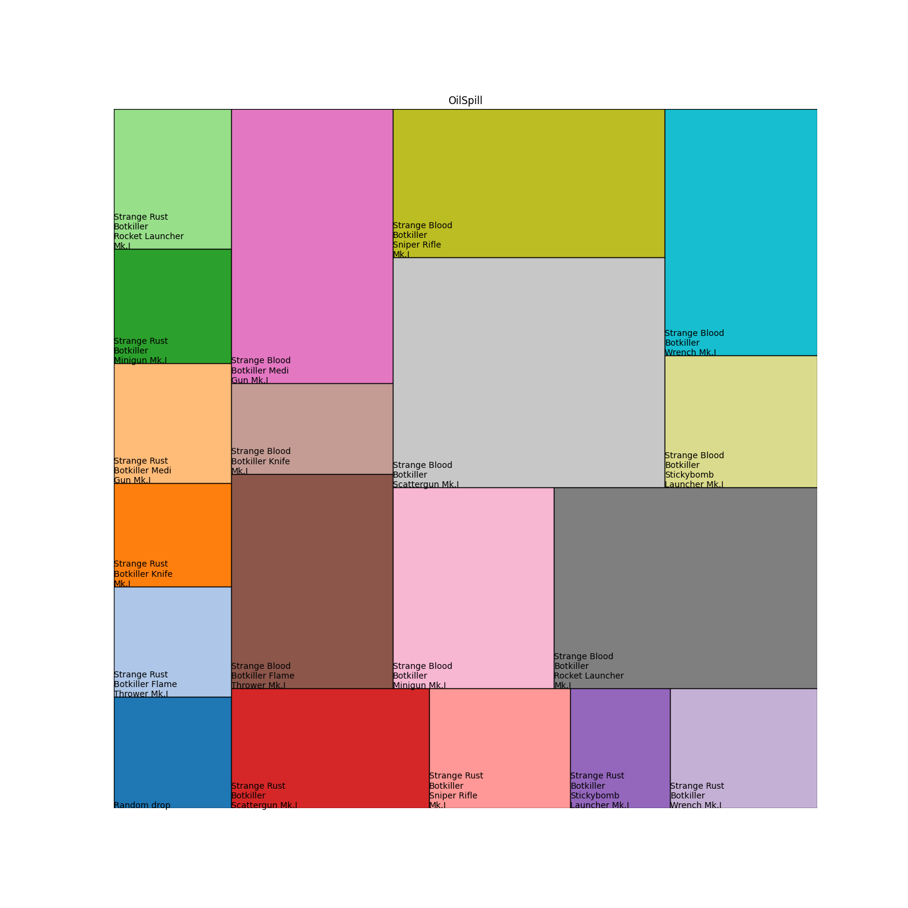
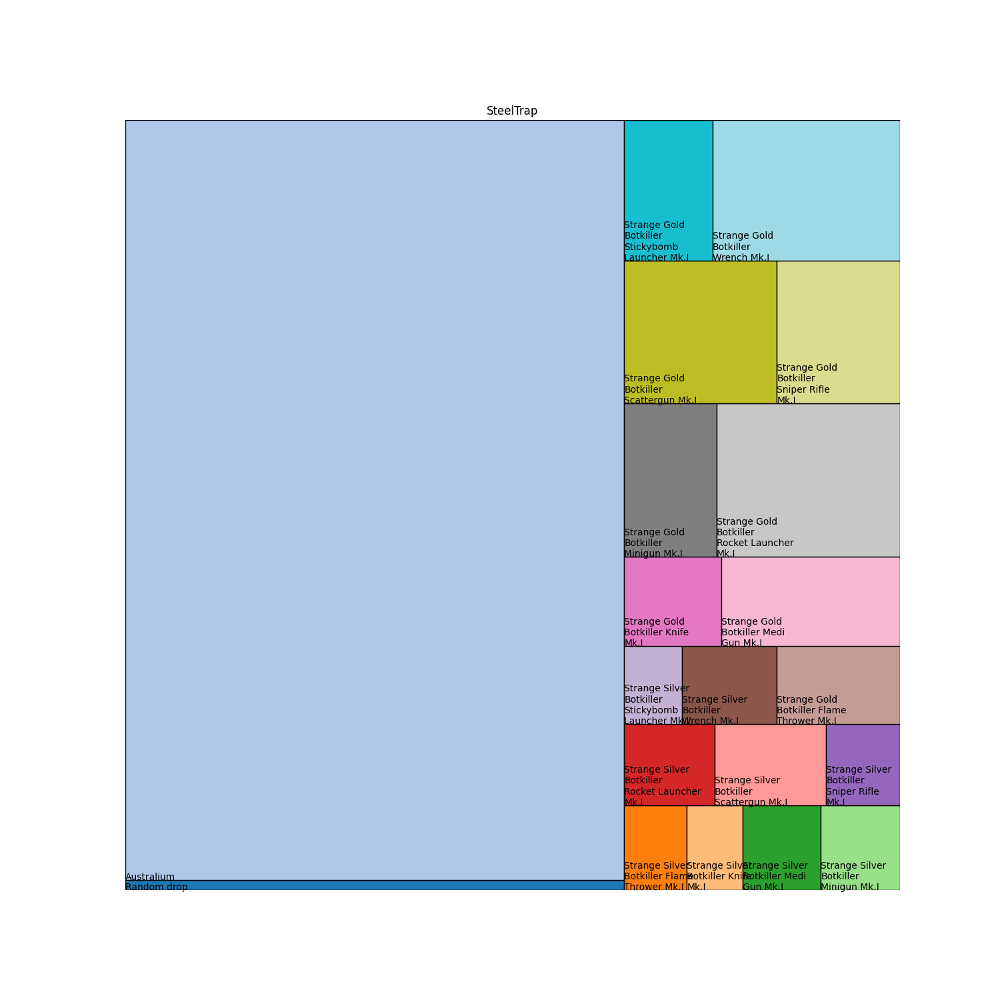
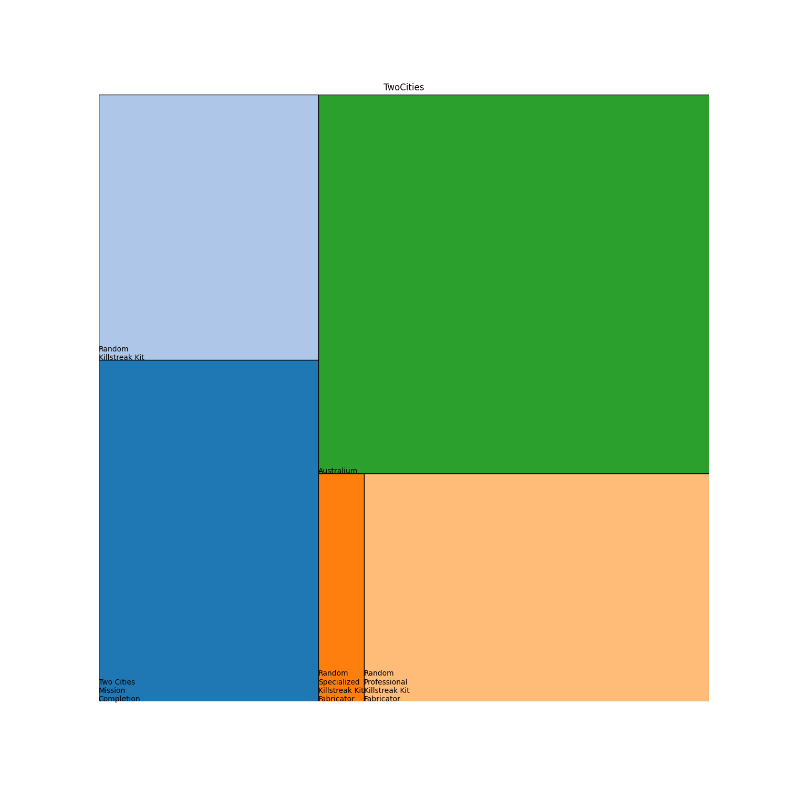

<!-- 
Copyright 2024 Kieran Harvie.
All rights reserved.
Use of this source code is governed by an MIT-style license that can be found in the LICENSE file.
-->

This repo is a quick treemap visualization of the expected value from a tour completion in TF2.
It is based on and uses data from the most recent, at time of writing, [TheLetterZed video](https://www.youtube.com/watch?v=kPR0KjP4hC8).

Basically a python script to transpose the data in the [spreadsheet](https://www.youtube.com/redirect?event=video_description&redir_token=QUFFLUhqa3JhNkVYVGVaNW54c1ZDWW14SmdvUF9zREJpZ3xBQ3Jtc0ttWW0ySW5ETGJ4N3BOQm5SZ3VKclRxcUNucV9NNGNuTW5SU1RwcnVZZWZUMVk4WDJPX3R0Z1BWNnhIS0xjQTRnT0NvekpkeFV3QkJOMER4NmNBQXhZRHk0UklPUDl1dFAtOEVFR1Z3QnZ6cW1meHpqcw&q=https%3A%2F%2Fdocs.google.com%2Fspreadsheets%2Fd%2F1UvPC-FKVYYY8q8Zb18fjxb-AmZgZbQ471tu5TsjG3w0%2Fedit%3Fusp%3Dsharing&v=kPR0KjP4hC8) from the video description into the [squarify](https://github.com/laserson/squarify/tree/master) module. 

